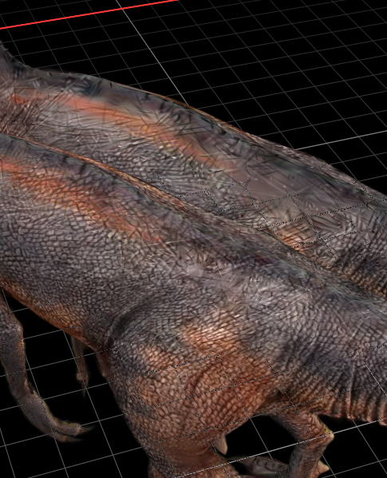

# Quality v2 + Planner 同素材视频 002 对照测试记录（2026-09-20）

本文分析同一份视频在两个版本路径下的端到端结果：图 1 为未使用 Quality v2 和 Planner 的历史流程，图 2 为同时启用 Quality v2 与 Planner v2 的当前流程。本文只记录测试数据、归因边界和有效性结论。

## 1. 对照对象

| 组别 | 项目 | 流程 | 工程 Schema | 执行路径 |
|---|---|---|---:|---|
| A：历史基线 | `20260901-094941_002` | 无 Quality v2、无 Planner | 4 | 安装版引擎 |
| B：当前组合 | `20260920-190836_002` | Quality v2 High + Planner v2 | 8 | Debug 工程引擎 |

两个工程中的源文件均为：

- 时长：`56.2 秒`
- 分辨率：`1920 × 1080`
- 帧率：`30 fps`
- 总帧数：`1686`
- 编码：`ProRes / yuva444p12le`
- 文件大小：`1,190,545,156 bytes`
- SHA-256：`7BAEB03E1D91A55EC5ED6CC50D0E423FF81FB0D1AE36F7B9E4DA8D7705B855E8`

补充人工确认的拍摄结构：素材不是单次环绕，而是由多段视频组成；各段均在近似相同的相机高度，围绕同一个物体重复完成 `360°` 旋转。因此，素材在时间上包含多轮重复轨迹，方位角被反复覆盖，但没有通过改变拍摄高度显著增加俯仰方向的视角多样性。

这一结构意味着“视频总帧数”不等于“独立视角数量”。A 的 1686 帧包含大量相同或邻近方位的重复观测；B 的 422 帧也很可能已经覆盖多轮完整方位，但每一轮内部的局部角度采样更稀疏。对本案例的判断需要同时区分全局方位覆盖、局部角度密度、重复观测质量和最终外观密度。

因此可以确认两次运行使用的是字节级完全相同的输入素材。

需要注意，A 与 B 的应用版本、工程 Schema 和引擎所在路径不同，而且一次同时改变了 Quality 和 Planner，不能将全部差异解释成 Planner 的独立净收益。本测试可以评价“当前 Quality v2 + Planner 组合相对历史流程是否有效”，也可以通过阶段日志判断各模块的贡献方向，但不是只切换 Planner 开关的严格 A/B。

## 2. 端到端结果

| 指标 | A：历史基线 | B：Quality v2 + Planner | 变化 |
|---|---:|---:|---:|
| 总耗时 | 2小时18分10.396秒 | 34分02.036秒 | 缩短 1小时44分08.360秒，`-75.4%` |
| 速度倍数 | 1.00× | 4.06× | B 约为 A 的 `4.06×` |
| 输入 SfM 帧数 | 1686 | 422 | `-75.0%` |
| 实际采样密度 | 30.000 fps | 7.509 fps | `-75.0%` |
| 注册图片 | 1686 / 1686 | 422 / 422 | 两者均为 `100%` |
| 三维点 | 378,744 | 48,689 | `-87.1%` |
| 最终 Splat | 378,788 | 62,293 | `-83.6%` |
| PLY 大小 | 85.3 MiB | 14.0 MiB | `-83.6%` |

组合方案在保留约四分之一输入帧的情况下仍完成全部入选画面的注册，总耗时缩短 75.4%。从“生成成功、注册完整、显著降低等待时间”的产品目标看，组合方案有效。

但 B 的三维点、Splat 和文件体积均明显小于 A。较小的 PLY 不能自动等同于质量下降；本次补充的人工视觉验收进一步确认，A 的外观效果明显优于 B，因此在这份素材上，B 的效率收益没有维持与 A 等价的视觉结果。日志中的密度下降与实际外观差异方向一致。

## 3. 阶段耗时

| 阶段 | A：历史基线 | B：Quality v2 + Planner | 变化 |
|---|---:|---:|---:|
| FFprobe | 0.025 秒 | 0.091 秒 | 可忽略 |
| 正式画面提取 | 11.152 秒 | 5.146 秒 | `-53.9%` |
| Feature Extraction | 1分12.563秒 | 20.232 秒 | `-72.1%` |
| Matching | 21.148 秒 | 1分59.383秒 | `+464.5%`，约 5.65× |
| Incremental Mapper | 1小时47分11.044秒 | 5分27.902秒 | `-94.9%`，约 19.61× |
| COLMAP 合计 | 1小时48分44.755秒 | 7分47.517秒 | `-92.8%` |
| Brush | 29分13.442秒 | 26分04.033秒 | `-10.8%` |
| Brush 前总耗时 | 1小时48分56.954秒 | 7分58.003秒 | `-92.7%` |
| 任务总耗时 | 2小时18分10.396秒 | 34分02.036秒 | `-75.4%` |

日志中的已知进程耗时几乎覆盖全部任务耗时：A 只有约 `1.0 秒`、B 约 `5.2 秒`属于进程启动、Planner 分析、状态保存和发布等其他开销，因此阶段对比具有较高可信度。

### 3.1 总节省来自哪里

Mapper 从 `6431.044 秒`降至 `327.902 秒`，单阶段节省 `6103.142 秒`，相当于全部端到端节省时间的约 `97.7%`。

两次运行使用的都是 Incremental Mapper，所以这一收益不是 Mapper 后端变化带来的。主要原因是 Mapper 输入从 1686 帧减少到 422 帧，显著降低了相机注册、三角化和 Bundle Adjustment 的规模。

Feature Extraction 另外节省约 `52.3 秒`，正式抽帧节省约 `6.0 秒`，Brush 节省约 `189.4 秒`。Matching 则多耗时约 `98.2 秒`，抵消了一部分其他阶段收益。

## 4. Frame Planner 分析

B 的 FramePlan 记录：

| 指标 | 数值 |
|---|---:|
| Capture 类型 | `ObjectOrbit` |
| Motion level | `Low` |
| Temporal confidence | 0.95 |
| Loop prior | 0.6961 |
| Capture confidence | 0.95 |
| High 正常目标 FPS | 8.294 |
| 实际平均 FPS | 7.509 |
| 筛选前目标帧数 | 466 |
| 筛选后帧数 | 422 |
| 最低数量回填 | 0 |
| Minimum required FPS | 0.534 |
| Minimum Frame Override | 未触发 |

Planner 将 1686 帧减少到 422 帧，减少 `1264` 帧，即 `75.0%`。入选帧覆盖完整视频时间范围，帧索引大部分以约 4 帧间隔推进，与实际约 7.5 fps 一致。

进一步核对 FramePlan 后可以确认，422 个入选帧之间的 421 个帧间隔全部为 4，即本次结果实际上是严格的均匀时间降采样。入选帧平均清晰度为 `0.20237`，未入选帧为 `0.20135`，差异很小；以每个入选帧附近的四帧窗口计算，入选帧恰好是局部最清晰帧的比例只有 `55 / 422 = 13.0%`。因此，本次降帧主要依赖固定时间间隔，而不是用明显更清晰的画面替代被删除的画面。

结合多段重复 360° 轨迹来看，均匀覆盖完整时间轴并不等同于有效地消除重复视角。它会在每一轮旋转中都降低局部角度密度，同时仍从不同片段保留若干相同或邻近方位的重复观测。Planner 当前记录中没有按圈次或方位角聚类后再选择“同一方位的最佳观测”，所以无法确认 422 帧是否构成了最有效的 422 个视角。B 的 100% 注册说明全局方位覆盖足以完成重建，但不能证明局部表面采样和外观观测已经充分。

这段 56.2 秒素材不是短视频，最低 30 帧保护没有参与决策。422 帧远高于最低目标，因此本案例不能用于评价 Minimum Frame Protection；它主要验证的是 Quality FPS Budget 与自适应筛选。

从结果看，Frame Planner 的效率收益非常明确：输入减少四分之三后，全部 422 帧仍被注册，View Graph 仍保持完整连通，Mapper 耗时降低 94.9%。

## 5. Pairing Planner 分析

两次 Matching 路径不同：

| 项目 | A：历史基线 | B：Quality v2 + Planner |
|---|---|---|
| 策略 | Sequential | Sequential with Loop Closure |
| Sequential overlap | 10 | 20 |
| Loop Detection | 否 | 是 |
| Vocabulary Tree | 否 | 是，本地打包文件 |
| Matching 耗时 | 21.148 秒 | 119.383 秒 |

B 虽然只有约四分之一的帧，却因为 overlap 加倍并执行 Vocabulary Tree Loop Closure，使 Matching 耗时达到 A 的约 `5.65×`。从纯耗时角度看，本次 Pairing Planner 是明确的负收益。

B 生成的 View Graph 指标为：

- 图片数：422；
- 已连接图片：422；
- 连通分量：1；
- 最大连通分量比例：1.0；
- 2-core 比例：1.0；
- bridge 比例：0；
- 中位度数：12；
- 中位 inliers：771；
- 长距离边比例：0.4705；
- Graph decision：`Healthy`。

这些指标说明 B 的匹配图连接强、没有桥接瓶颈，并包含较多长距离联系，与 Loop Closure 的目标一致。但由于没有“同样 422 帧、关闭 Loop Closure”的对照，无法证明健康 View Graph 必须依赖这 98.2 秒额外 Matching 成本。

多轮重复 360° 轨迹也为这些指标提供了新的解释：相隔很远的时间点可能处于相同或相近方位，Vocabulary Tree Loop Closure 很容易建立跨片段长距离边，并让同一批稳定特征形成更长轨迹。因此，`longRangeEdgeRatio = 0.4705`、完整 2-core 和较长 track 不只代表视角覆盖良好，也包含重复轨迹自身带来的连接增益。健康 View Graph 能证明相机网络稳固，但不能单独证明独立表面区域、局部角度采样或外观信息足够。

因此 Pairing Planner 在本案例中的结论是：连通性结果优秀，但时间效率不佳；是否属于必要成本，现有数据不能单独证明。

## 6. Mapper、Graph Gate 与 Recovery

| 项目 | B 的实际决策 |
|---|---|
| GraphQualityGate | `Healthy` |
| Mapper planned | `Incremental` |
| Mapper actual | `Incremental` |
| Mapper reason | `production_incremental_only` |
| Normal Rescue | 0 轮 |
| SuccessRecovery | 未进入 |
| Budget override | 否 |

GraphQualityGate 对健康图没有触发补帧或扩大 Matching，避免了额外 Rescue 成本，这一决策与 View Graph 指标一致。

两次运行的 Mapper 都是 Incremental，因此本测试没有验证 MapperSelector，也没有发生 Global 与 Incremental 的选择收益。B 的 Mapper 加速应归因于更小且仍然连通的 SfM 输入，而不是 Mapper 类型变化。

Normal Rescue、SuccessRecovery、最低帧数保护和 Global 实验路径均未被触发，因此本案例不能评价这些模块的有效性。

## 7. 稀疏重建质量

A 的旧工程没有保存新版 Planner 指标。为统一口径，本次对其归档稀疏模型执行了只读 `COLMAP model_analyzer`；B 使用 Planner 保存的最佳候选指标。

| 指标 | A：历史基线 | B：Quality v2 + Planner | 变化 |
|---|---:|---:|---:|
| 注册率 | 100% | 100% | 相同 |
| 三维点 | 378,744 | 48,689 | `-87.1%` |
| Observations | 4,382,417 | 980,482 | `-77.6%` |
| Mean track length | 11.571 | 20.138 | `+74.0%` |
| Mean observations / image | 2599.298 | 2323.417 | `-10.6%` |
| Mean reprojection error | 0.3269 px | 0.3917 px | 增加 0.0649 px，`+19.8%` |

B 的稀疏点和总观测显著减少，这是输入帧减少后的直接结果。与此同时，平均轨迹长度提高 74.0%，说明保留下来的每个三维点平均获得了更多视角支持；这与健康、高连通的 View Graph 一致。

在多轮重复同高度轨迹下，更长的平均轨迹还可能表示同一三维点在多次经过相近方位时被重复观测。它提高了已有点的支持强度，却不会自动增加新的表面点。B 的帧数是 A 的 `25.0%`，三维点却只有 A 的 `12.9%`，说明几何密度下降速度快于帧数下降；重复圈次和 Loop Closure 主要加强了少量稳定点，而没有补回被局部降采样削弱的细节特征、轮廓点和低纹理区域。

B 的平均重投影误差比 A 高约 0.065 px，但两者都低于 0.4 px，绝对差值较小。B 的每图平均观测下降 10.6%，没有随输入帧数同比下降。

综合这些指标，B 不是简单地以失败或脆弱重建换取速度。它保留了完整注册和较强的跨视角轨迹支持，但稀疏点密度明显降低。结合人工视觉验收，当前可以确认这种密度下降已经转化为可见的外观损失；“注册稳定”与“外观质量充分”在本案例中并不等价。

## 8. 稀疏模型选择与候选验证

B 的 Incremental Mapper 生成了两个模型：

| 模型 | 注册图片 | 三维点 | 平均轨迹 | 重投影误差 |
|---|---:|---:|---:|---:|
| 模型 0 | 2 | 1,211 | 2.000 | 0.1292 px |
| 模型 1 | 422 | 48,689 | 20.138 | 0.3917 px |

Pipeline 在同一次 Mapper 输出内部按注册图片数选择模型 1，再将其记录为 `normal-0-incremental` 候选并交给 Brush。该过程正确避开了只有 2 张图片的小模型，说明稀疏模型校验与候选构建在本案例中有效。

本次只有一个 Planner reconstruction candidate，因此 `ReconstructionComparator` 没有发生多个 Normal / Rescue 候选之间的实质排序。本案例不能单独评价跨候选比较策略。

## 9. Brush 与最终输出

| 项目 | A：历史基线 | B：Quality v2 + Planner |
|---|---:|---:|
| Brush iterations | 30,000 | 30,000 |
| 传入最大分辨率 | 2000 | 1920 |
| Brush 耗时 | 29分13.442秒 | 26分04.033秒 |
| 最终 Splat | 378,788 | 62,293 |
| PLY | 85.3 MiB | 14.0 MiB |

### 9.1 实测外观对比

*图：用户提供的 video 002 同素材外观效果对比。人工视觉验收中，A 的表面细节、局部连续性和整体完整度明显优于 B。该图片作为定性证据，与下方稀疏点和最终 Splat 数量的定量差异结合判断。*

两次 Brush 迭代数相同，B 的最大分辨率按源素材尺寸限制为 1920，A 传入 2000。B 的 Brush 只缩短 10.8%，远小于 SfM 阶段的 92.8% 降幅，说明固定 30,000 次训练仍是 B 的主要耗时来源。

两次运行使用的 Brush 可执行文件 SHA-256 完全相同，COLMAP 可执行文件 SHA-256 也完全相同，因此可以排除引擎二进制版本差异。两边源图宽度均为 1920，A 的 2000 与 B 的 1920 是最大分辨率上限，这个参数差异也不足以解释约 6 倍的最终 Splat 差距。抽查的对应入选帧文件为字节级一致，A、B 每图平均 SIFT 特征分别为 `3203.68` 和 `3203.04`，特征上限没有造成显著的单帧特征差异。

A 从 378,744 个稀疏点得到 378,788 个最终 Splat，最终数量几乎与初始稀疏点一致；B 从 48,689 个稀疏点增长到 62,293 个 Splat，虽增加约 27.9%，最终仍只有 A 的 16.4%。这表明当前 Brush 的最终表达密度高度依赖 COLMAP 提供的稀疏几何种子，固定 30,000 次训练没有补回因降帧而缺失的大量点。人工观察到的 B 外观下降与这一数据关系一致。

重复同高度环绕能够增加相同可见表面的重复观测，却不能提供新的俯仰视角；A、B 都受这一素材结构限制。A 的优势主要来自更密集的局部角度与重复观测形成了更多稀疏点和 Gaussian，而不是获得了额外的顶部或底部几何覆盖。

## 10. 归因边界

### 可以直接确认

- 两次输入视频完全相同。
- Quality v2 + Planner 组合将 SfM 输入从 1686 帧降至 422 帧。
- 422 帧全部注册，View Graph 为 Healthy，没有触发 Rescue。
- 组合方案总耗时缩短 75.4%，Brush 前耗时缩短 92.7%。
- 最大收益来自更少输入帧带来的 Incremental Mapper 降本，不来自 Global Mapper 或 Mapper 后端切换。
- Pairing Planner 的 Loop Closure 在本案例中增加约 98.2 秒 Matching 时间。
- Pipeline 的稀疏模型校验正确选择了 422 张图片的完整模型，而不是 2 张图片的小模型。
- Brush 与 COLMAP 二进制在两次运行中完全相同；两边每图平均 SIFT 特征数基本一致。
- 人工视觉验收确认 A 的外观效果明显优于 B，二者在本素材上不具备视觉质量等价性。

### 可以合理推断，但不是独立因果证明

- 均匀降帧去除了大量时间冗余，并保留了足以完成全注册的全局方位覆盖，但没有保留与 A 等价的局部角度密度和外观表达密度。
- Loop Closure 与较高长距离边比例、完整 2-core 和零 bridge 的健康图结构相符。
- 更长的平均轨迹表明降帧后保留的稀疏点具有较强的多视角支持，同时也受到多轮重复方位观测的强化。
- B 的视觉损失主要与稀疏点和最终 Splat 密度下降有关，而不是引擎版本、训练迭代数或单帧特征数量差异。

### 不能从本组数据单独确认

- Planner 相对于“同一 Quality v2、仅关闭 Planner”的独立净收益。
- Loop Closure 是否是达到 100% 注册所必需的。
- Minimum Frame Protection、Normal Rescue 和 SuccessRecovery 是否有效。
- Global Mapper 与 Incremental Mapper 的相对效果。
- Quality v2 与 Planner 各自对视觉损失承担的独立比例，因为本次没有“同一 Quality v2、仅关闭 Planner”的严格对照。

## 11. Planner 有效性结论

在这份 56.2 秒、由多段同高度重复 360° 环绕组成的视频上，当前 Quality v2 + Planner 组合对“生成成功与时间效率”的作用明确有效：它只使用原始帧数的约 25%，仍实现入选帧 100% 注册、单一健康 View Graph、较长的特征轨迹，并把端到端时间从 2小时18分10秒降至 34分02秒。

Planner 的主要时间收益来自 Frame Planning 和对健康图不执行 Rescue。它们共同缩小了 Incremental Mapper 的规模，使 Mapper 耗时减少 94.9%；稀疏模型校验也正确保留了完整模型。但是，本次 FramePlan 实际采用固定四帧间隔，没有按重复圈次和方位选择最佳观测。对这种周期性轨迹，覆盖完整时间轴并不能保证保留最有效的视角集合。

Planner 的 Pairing 决策在时间维度上表现不佳：Sequential with Loop Closure 比历史 Sequential 多耗时约 98.2 秒。虽然最终图结构优秀，但本组数据不能证明这部分额外成本不可缺少。

从几何指标看，组合方案维持了完整注册，平均轨迹长度更高，重投影误差只增加约 0.065 px；但重复轨迹会天然强化 Loop Closure、长距离边和已有点的 track length，这些健康指标没有反映独立表面点密度。B 的三维点只有 A 的 12.9%，最终 Splat 只有 A 的 16.4%，而 Brush 没有在相同 30,000 次训练内补回差距。

人工视觉验收已经确认 A 的外观明显优于 B，因此本案例不再只是“视觉等价性未被证明”，而是已经观察到明确的质量回退。更准确的综合判断为：**Planner 显著提高了时间效率并保持了重建成功，但当前针对重复同高度环绕素材的均匀降帧过度压缩了局部观测与稀疏几何密度；Graph Healthy 和 100% 注册未能预测这一外观损失，Pairing 还额外增加了 Matching 时间。**
